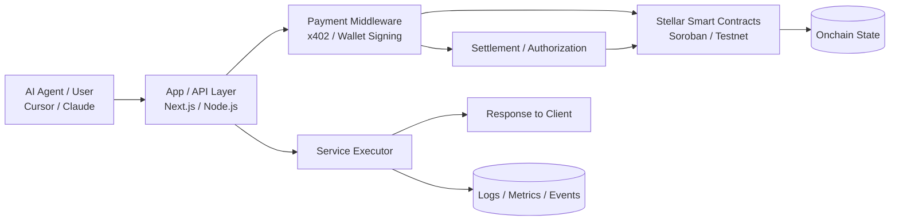
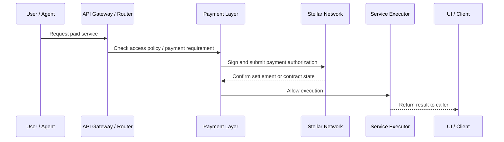
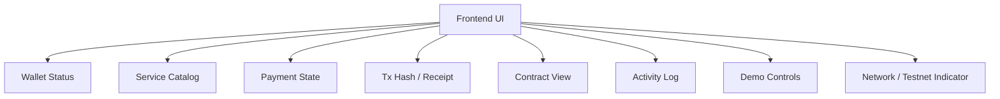
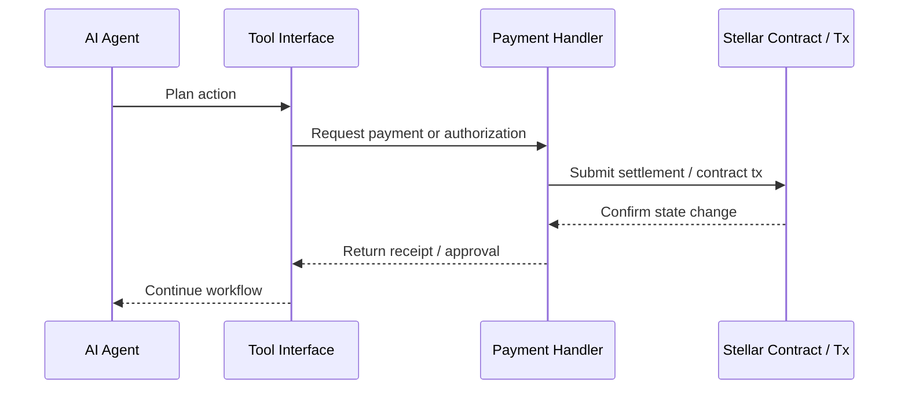
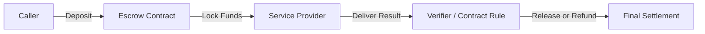
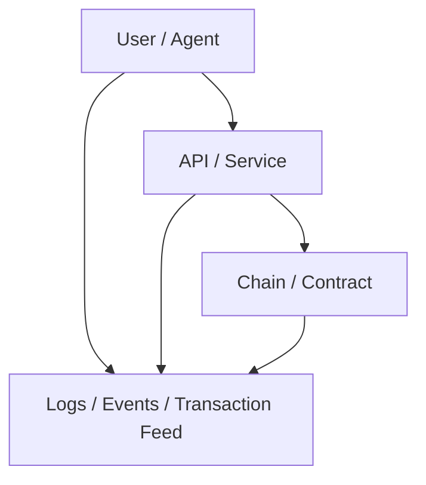

# Stellar Hacks: Pay-per-Query Web Search MCP Server

### Problem: 
AI agents need real-time search but monthly subscriptions waste money per query. API keys are fragile and require manual setup.

###  Solution: 
An MCP server that lets Claude Code, Cursor, or any MCP client pay 0.001 USDC per Brave Search API call via x402. The server proxies the search, adds an x402 paywall, and settles micropayments on Stellar testnet. Solves a real pain (agent search billing), uses x402 natively, includes a working MCP server (demo-ready in 2 days), and was inspired by the "concrete demand signal" idea.
###  Key features: 
MCP tools/search endpoint, x402 facilitator integration, Stellar testnet funding via Lab, 2-min video showing Claude paying for a search.

***

# Why This Exists

Agent systems often fail at the moment they need to pay for something. They can reason, choose tools, and generate actions, but the payment step usually requires extra integrations, manual billing, or fragile API keys. This project removes that friction by putting payment logic and service access under a unified protocol and contract architecture.

Stellar is a strong fit because it offers low fees, fast settlement, native stablecoin support, and contract-level guardrails. That makes it practical for micropayments, request-based billing, and automated service access. The result is an architecture where agents can act economically, not just intellectually.

***

# Core Capabilities

The platform is organized around a few core capabilities:

- Pay-per-request service access.
- Agent-to-agent payment workflows.
- Smart contract-backed service registration.
- Optional escrow and reputation tracking.
- Wallet connection and signing.
- Local developer experience with testnet support.
- Clear observability through logs, dashboards, and transaction links.

Each part is designed to be independently useful, but the real value comes from combining them into one flow. A user or agent requests a service, pays for access, receives the result, and the system records the interaction in a way that is auditable and extensible.

***

# High-Level Architecture

This architecture separates experience, logic, and settlement. The app layer handles requests and UI, the payment middleware handles authorization and charging, and the chain layer stores the durable system state.

***

# System Components

The repository is typically divided into the following parts:

- `contracts/` for Soroban smart contracts.
- `server/` for payment and agent service endpoints.
- `web/` for the frontend application.
- `mcp/` for agent-accessible tooling.
- `scripts/` for deployment, minting, or testnet setup.
- `docs/` for diagrams, walkthroughs, and technical notes.

This layout keeps the codebase maintainable. It also makes it easier to swap one part without breaking the rest, which matters when you’re iterating fast.

***

# Data Flow

This flow is intentionally simple. The caller starts with a request, the system determines whether payment is required, settlement happens, and the service result is released only after the required conditions are met.

***

# Smart Contract Layer

The smart contract layer is responsible for canonical state. It should not depend on transient app state for important logic like ownership, service listing, escrow, reputation, or budget limits. The contract should be minimal, deterministic, and easy to audit.

Typical onchain responsibilities include:

- Registering services or agents.
- Recording pricing metadata.
- Tracking payment or escrow status.
- Enforcing access control.
- Storing trust or reputation markers.
- Emitting events for offchain indexing.

The contract should favor explicit methods and small state transitions. Avoid embedding complex business logic in a single method when it can be decomposed into smaller operations.

***

# Contract Design Principles

The contract should follow these rules:

- Every write path must be permissioned.
- Every amount must be validated.
- Every state transition must be deterministic.
- Every external interaction must be inspectable.
- Every method should have a single responsibility.
- Every error should be explicit and typed.

These rules keep the chain state clean and reduce the chance of bugs that are hard to diagnose later. They also make the code much easier to review in a hackathon or security audit setting.

***

# Contract Data Model

A practical contract data model might include:

- `services`: mapping of service IDs to metadata.
- `owners`: mapping of service IDs to owners.
- `balances`: mapping of user or agent balances.
- `escrows`: mapping of payment IDs to locked funds.
- `reputation`: mapping of service IDs to trust scores.
- `policies`: mapping of wallet or account restrictions.

The exact shape depends on the use case, but the underlying pattern is the same: one contract stores the canonical business state and enforces who can mutate it.

***

# Payment Middleware

The payment middleware is the bridge between the caller and the chain. It can implement paywalls, authorization checks, payment receipts, and retries. If a request requires payment, the middleware should return a structured challenge or payment requirement.

Good middleware should:

- Identify the requested service.
- Compute the required payment.
- Build or validate authorization.
- Route the payment to the correct destination.
- Confirm settlement before releasing service output.
- Produce a clean response that the frontend or agent can consume.

This layer is especially important because it turns the contract into a practical product rather than a raw chain primitive.

***

# Payment Modes

There are usually three useful payment modes:

## 1. Per-request payment

Each API call requires one payment. This is ideal for expensive or discrete services like search, data lookup, or agent tool access.

## 2. Prepaid credit

A wallet pre-funds an account and then spends from that balance over time. This is useful when repeated requests are expected.

## 3. Streaming or session-based settlement

A long-running session pays incrementally. This works well for AI inference, continuous compute, or frequent tool calls.

The project can support one mode or all three, depending on scope. For a hackathon, per-request payment is usually the safest starting point.

***

# Frontend Experience

The frontend should make the payment journey obvious. A user should be able to connect a wallet, select a service, see the payment requirement, approve the payment, and receive the result without confusion.

Recommended UI sections:

- Hero panel with project summary.
- Wallet connection state.
- Service catalog.
- Payment challenge viewer.
- Transaction status panel.
- Contract state inspector.
- Activity history and logs.

The UI should favor clarity over visual complexity. A polished but simple interface is usually better for demos and reduces the chance of confusing the user.

***

# Frontend Diagram

This layout keeps the most important operational details visible at all times. It gives the user confidence that the system is doing something real and not just simulating a result.

***

# Agent Integration

A major goal of the repository is to make services callable by AI agents. That means the system should expose a clean tool interface, either through an MCP server or a similar agent-accessible API layer.

Useful agent tools include:

- `list_services`
- `inspect_service`
- `request_service`
- `approve_payment`
- `check_tx_status`
- `get_contract_state`
- `submit_proposal`
- `record_completion`

These tools let an agent discover what is available, pay for what it needs, and continue the workflow without human intervention.

***

# Agent Workflow Diagram

This diagram shows the crucial separation between planning and settlement. The agent decides what to do, but the payment and execution layer enforces the rules.

***

# Security Model

Security should be a first-class concern, even in a hackathon project. The system should assume that callers can be malicious, impatient, or incorrect. The safest approach is to make every onchain or paid action explicit and auditable.

Key protections should include:

- Strict ownership checks.
- Replay protection for paid requests.
- Expiration for payment challenges.
- Rate limiting for repeated calls.
- Input validation for all numeric values.
- Clear failure handling and rollback logic.

If the platform manages funds or escrow, the contract should never trust the frontend to enforce the rules. All important enforcement must happen onchain or in verified server logic.

***

# Access Control

Access control should be simple but strict. Some actions should be public, such as browsing services or viewing contract state. Other actions should require payment, wallet ownership, or contract-level authorization.

Examples:

- Public: service browsing, metadata lookup, transaction viewing.
- Paid: premium API access, agent tool calls, data retrieval.
- Restricted: service registration, price updates, withdrawal, contract admin actions.

This makes the application easier to understand and reduces the risk of exposing sensitive operations to unauthorized users.

***

# Escrow and Settlement

If the app includes escrow, the basic idea is to lock payment until a condition is met. That condition may be a successful service call, proof of delivery, a signed result, or a contract-approved state transition.

A simple escrow flow looks like this:

1. Caller deposits funds.
2. Contract locks funds.
3. Service is executed.
4. Result is verified.
5. Funds are released or refunded.

This model is especially useful for agent marketplaces because it reduces trust assumptions between buyers and service providers.

***

# Escrow Diagram

This diagram captures the core trust-minimization idea. The contract becomes the neutral party that decides whether the service delivery was good enough to unlock payment.

***

# Reputation System

A reputation layer can be added to track service reliability. This is useful in agent markets where the quality of a service may vary over time. Reputation can be based on successful completions, failed calls, dispute outcomes, or user feedback.

Possible reputation signals:

- Number of successful deliveries.
- Average response time.
- Payment settlement history.
- Refund frequency.
- User ratings.
- Contract-level attestations.

The reputation layer should remain lightweight. It is best treated as a signal, not an absolute truth.

***

# Backend Services

The backend should expose practical endpoints rather than generic abstractions. Useful services include:

- `GET /services`
- `GET /services/:id`
- `POST /request`
- `POST /paywall`
- `POST /settle`
- `GET /status/:tx`
- `GET /contract/:id`
- `POST /agent/execute`

Each endpoint should be documented and easy to test locally. That makes the repo much more valuable to other developers.

***

# Local Development

The project should be easy to run locally without too much setup. A good local experience usually includes:

- Environment variable template.
- Local testnet or devnet config.
- Seed data for services and wallets.
- Clear start commands.
- Optional dockerized components.

The goal is to let another developer clone the repository and see a meaningful demo quickly. That lowers the barrier to contribution and improves reliability.

***

# Configuration

Use environment variables for all sensitive and environment-specific values. Avoid hardcoding private keys, contract IDs, RPC URLs, or service credentials.

Examples:

- Network selection.
- Contract IDs.
- Merchant account keys.
- API tokens.
- Payment thresholds.
- Demo feature flags.

***

# Testing Strategy

The test suite should focus on the most important flows:

- Contract initialization.
- Service registration.
- Payment authorization.
- Settlement verification.
- Escrow release or refund.
- Reputation updates.
- Failure cases and invalid inputs.

A practical test strategy usually combines contract unit tests, API integration tests, and a small end-to-end demo path. That gives confidence without overinvesting in exhaustive test coverage.

***

# Observability

The repository should show what is happening. At minimum, it should expose:

- Transaction hashes.
- Payment events.
- Service execution logs.
- Contract state snapshots.
- Error traces for failed requests.
- A small activity feed in the UI.

This is particularly important for demo environments. People trust a system more when they can see the state change in real time.

***

# Observability Diagram

This structure makes debugging much easier. It also makes the demo more convincing because the audience can follow the action end to end.

***

# Deployment Model

The deployment process should support at least two environments:

- Local development.
- Public testnet or preview network.

Ideally, deployment should be scriptable. That means a single command or small sequence should build contracts, deploy them, start the server, and launch the frontend.

You should document:

- How to deploy contracts.
- How to configure the server.
- How to seed demo data.
- How to connect a wallet.
- How to verify a payment onchain.

This makes the project feel complete and reproducible.

***

# Demo Story

A good demo should tell one simple story very well. For example:

1. Open the app.
2. Connect a wallet.
3. Choose a paid agent service.
4. See the payment challenge.
5. Approve payment.
6. Receive the result.
7. View the onchain trace.

The entire flow should feel coherent and fast. Demos usually fail when they try to show too many features at once.

***

# Implementation Priorities

If building from scratch, prioritize in this order:

1. Contract state and core methods.
2. Payment challenge and settlement logic.
3. Wallet connection.
4. End-to-end paid service flow.
5. Activity logging and transaction display.
6. Optional reputation or escrow enhancements.
7. Visual polish and docs.

This sequence ensures you have a working core before adding nice-to-have features.

***

# Common Pitfalls

Avoid these common mistakes:

- Making the contract too complex.
- Treating the frontend as the source of truth.
- Mixing demo state with canonical state.
- Hiding payment logic behind unclear abstractions.
- Under-documenting setup steps.
- Overpromising unsupported features.

A clean, honest, working system is usually better than an ambitious one that only works in theory.

***

# Contribution Guide

If the repository is meant for collaboration, include a short contribution guide. It should cover:

- How to run the project locally.
- How to add a new service.
- How to add a new contract method.
- How to test payment flows.
- How to propose changes.

This makes the project easier to extend and keeps contributions aligned with the system design.

***

# Suggested README Sections

A strong README should contain:

- Project overview.
- Motivation.
- Architecture.
- Smart contract design.
- Payment flow.
- Wallet integration.
- Agent tooling.
- Security model.
- Testing.
- Deployment.
- Demo walkthrough.
- Roadmap.

That structure is long enough to be detailed and short enough to remain readable.

***

# Roadmap

Possible future enhancements include:

- Multi-service agent marketplace.
- Session-based streaming payments.
- Advanced escrow arbitration.
- Service staking and slashing.
- Richer reputation and trust scoring.
- Dashboard analytics.
- Multi-wallet support.
- More agent tool integrations.

These features should be framed as future work, not prerequisites for the core release.

***

# License and Usage

The repository should include a clear license and usage statement. If some parts are experimental or testnet-only, say so. If the project is intended for hackathon use, document that clearly too.

